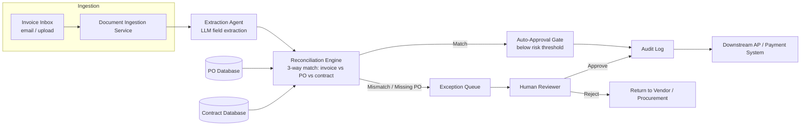

# Architecture

## Component Diagram

## Component List
- **Document Ingestion Service** — receives invoice documents (email attachment or upload), normalizes to text, hands off to the Extraction Agent. Out of scope for the code sample; simulated as reading a text file.
- **Extraction Agent** — the core agent pattern demonstrated in `design/code_sample/`. Calls the SharedLLM-gateway-routed Anthropic model to extract structured invoice fields (vendor, invoice number, PO reference, line items, totals) into a typed schema.
- **Reconciliation Engine** — deterministic (non-LLM) logic that compares the extracted invoice record against the PO Database and Contract Database, producing a match/mismatch/missing-PO verdict with human-readable discrepancy reasons.
- **PO Database / Contract Database** — simulated backends (in-memory dicts in the code sample, a real procurement/contract system of record in production) queried by reference number and vendor name.
- **Auto-Approval Gate** — allows only below-risk-threshold, clean matches through automatically in later phases (Release 1 keeps this human-gated per the non-negotiables in `discovery/problem_statement.md`).
- **Exception Queue** — holds any mismatch, missing-PO, or above-threshold case for human review.
- **Audit Log** — append-only record of every extraction, match decision, and human approval/denial, mirroring the `audit_log` pattern from the sibling `multi-agent-support-capstone` project.

## Data Flow
Invoice text flows in, gets extracted into a typed record, gets reconciled against simulated PO/contract
backends, and every outcome — whether auto-passed or human-reviewed — is written to the audit log before
reaching the downstream AP/payment system. No step writes to the payment system directly; the audit log is
the single source of truth for what happened and why.
