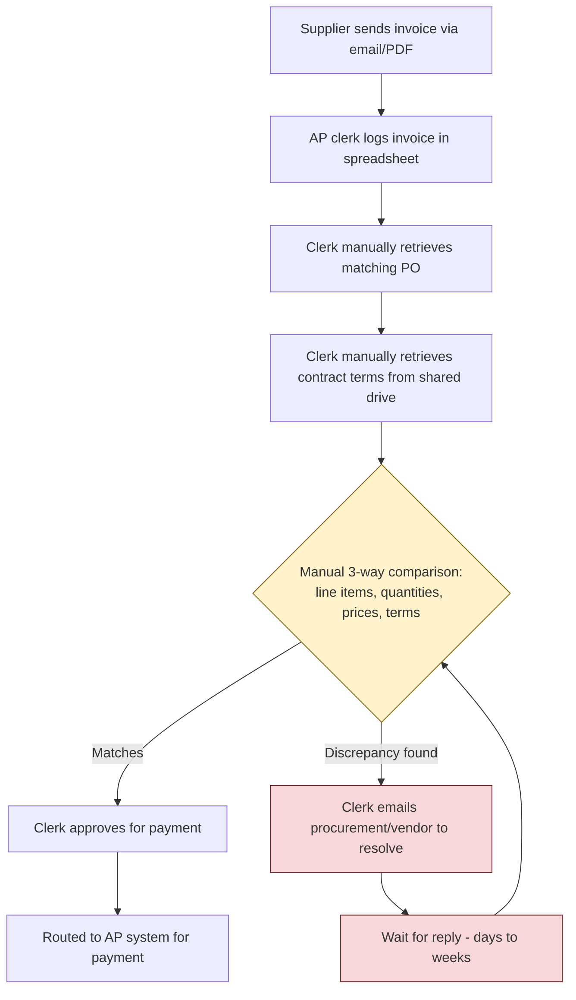

# Current-State Workflow

## Narrative
Today, every supplier invoice is reconciled entirely by hand:

1. A supplier emails or uploads a PDF invoice.
2. An AP clerk manually logs the invoice into a tracking spreadsheet.
3. The clerk looks up the matching purchase order in the procurement system — often by searching on vendor name, since PO numbers aren't consistently referenced on invoices.
4. The clerk pulls the underlying contract terms from a shared drive to check pricing and payment terms.
5. The clerk manually compares line items, quantities, unit prices, and totals across all three documents.
6. If everything matches, the clerk approves the invoice for payment.
7. If something doesn't match, the clerk emails procurement and/or the vendor to resolve the discrepancy, then waits — often days to weeks — before re-attempting the comparison.

## Where Errors and Delay Creep In
- **No single source of truth for contract terms** — clerks work from whatever version of the contract they can find on the shared drive, which is sometimes outdated.
- **Manual data entry** — line items are re-typed or eyeballed, introducing transcription errors.
- **Inconsistent escalation** — there's no standard SLA or routing rule for discrepancies, so resolution time varies wildly by clerk and vendor.
- **No audit trail** — approvals happen via email and spreadsheet edits, making it hard to reconstruct who approved what and why during an audit.

## Diagram

